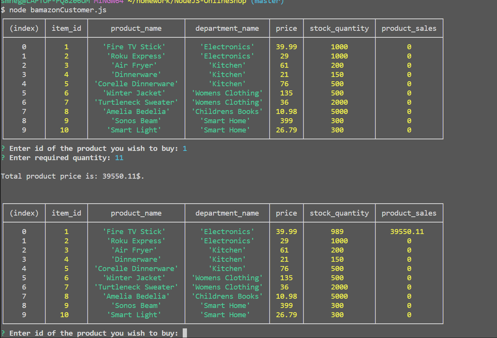
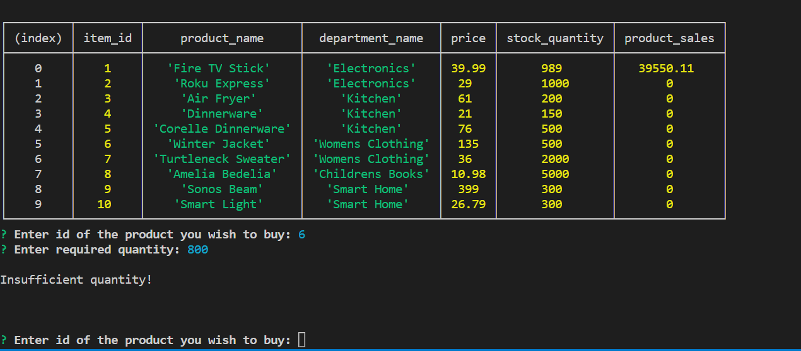

# BAmazon
This projects simulates online shopping using command line interface.

## Overview
This application comes with three distinct "Views", Customer, Manager, and Supervisor. The Customer can order items from Bamazon, the Manager can restock items and add new items for sale, and the Supervisor can check each department's profits and add new departments.

### Customer View
To check Customer view execute `node bamazonCustomer.js` from the applications root directory.

This will display all items that are avilable for purchase, and then prompt the user to choose an item and state how many of that item they intend to purchase.If there is enough of that item in stock, the purchase will go through.

If there is not enough, the user will be told that the stock is insufficient.

## Technologies Used:
* NodeJS
* NPM packages used - inquirer,mysql
* MYSQL
