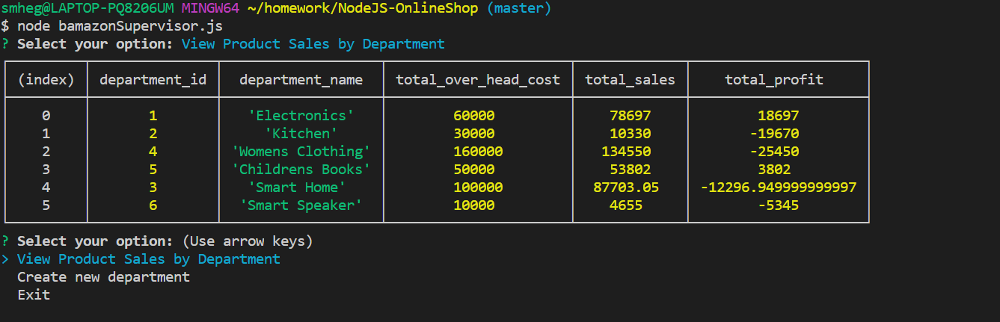
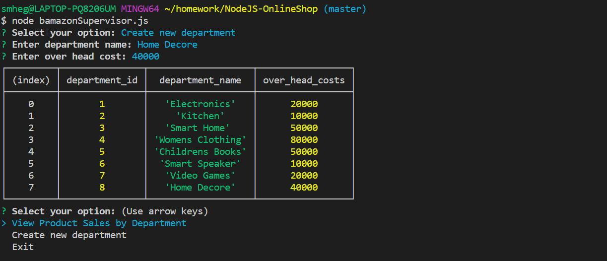

# BAmazon
This projects simulates online shopping using command line interface.

## Overview
This application comes with three distinct "Views" -(A) Customer (B) Manager and (C) Supervisor. The Customer can order items from Bamazon, the Manager can restock items and add new items for sale, and the Supervisor can check each department's profits and add new departments.

## Technologies Used:
* NodeJS
* NPM packages used - inquirer,mysql
* MYSQL

### (A) Customer View
---
To check Customer view execute command `node bamazonCustomer.js` from the applications root directory.

This will display all items that are avilable for purchase, and then prompt the user to choose an item and state how many of that item they intend to purchase.If there is enough of that item in stock, the purchase will go through.

If there is not enough, the user will be told that the stock is insufficient.

### (B) Manager View 
---
To check Manager view execute command `node bamazonManager.js` from the applications root directory.

A manager can perform following operations:

1. __View Products for Sale__:
This command displays all available products in the store: their IDs, names, prices, and remaining stock.

2. __View low inventory__:
This command displays all items with 5 or less that 5 stock remaining.

3. __Add to inventory__:
This command allows the Manager to add to to restock items that are currently in the store.

4.__Add new product__:
This command allows the Manager to add an entirely new product to the store.

### (C) Supervisor View
---
To check Supervisor view execute command `node bamazonSupervisor.js` from the applications root directory.

A Supervisor can perform following operations:

1.__View sale by department__
This command prints a table that lists each department's name and ID, along with its total sales, overhead costs, and total profit (sales - overhead).

2.__Create new department__
This command allows the supervisor to create an entirely new department.

